# TASK 4 API MANAJEMEN BUKU :

### Mengakses end point untuk register user :

```
http://localhost:5000/api/v1/auth/register
```

Lalu jika berhasil regist maka akan seperti ini :
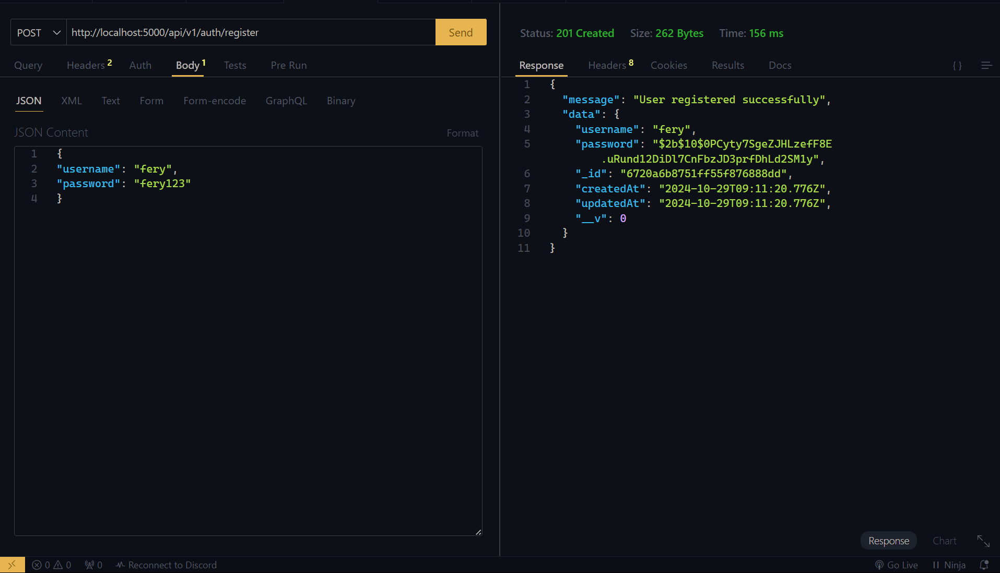

Lalu jika gagal regist maka akan tampil seperti ini :
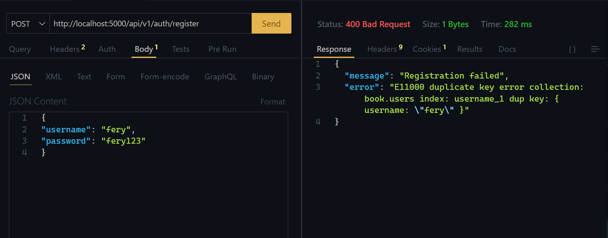

### Mengakses end point untuk login user :

```
http://localhost:5000/api/v1/auth/login
```

Jika berhasil login :
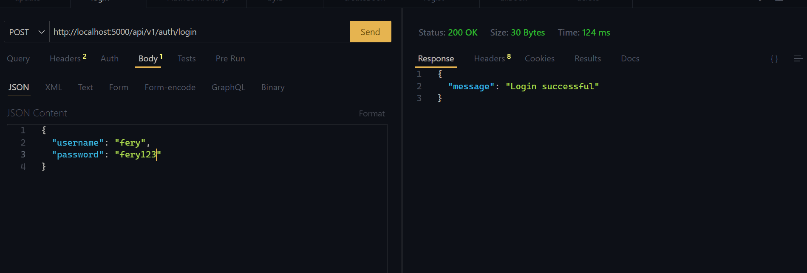

jika gagal login :
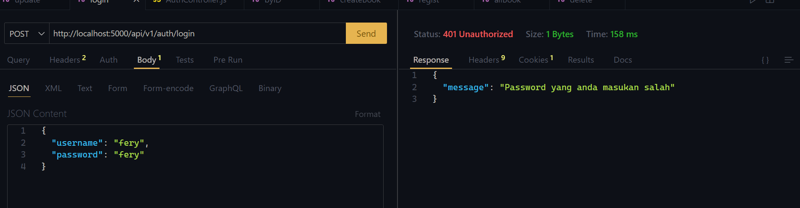

### Menagakses end point logout user :

```
http://localhost:5000/api/v1/auth/logout
```

Logout user success:
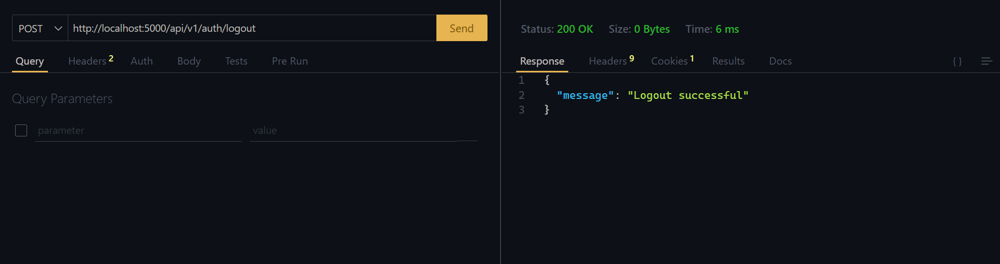

### Mengakses end point Create buku :

```

http://localhost:5000/api/v1/book

```

Jika berhasil menambahkan data buku :
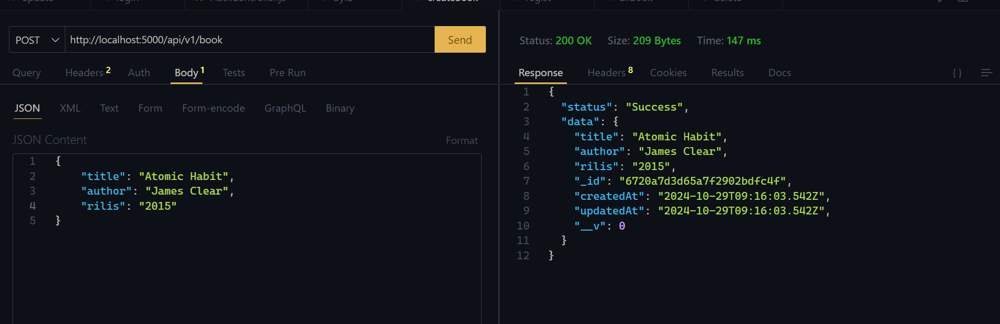

Jika gagal tambah data buku :
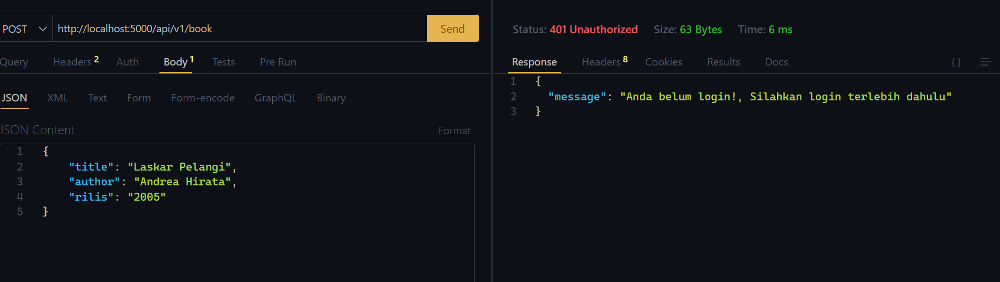

### Mengakses end point Read all data buku :

```
http://localhost:5000/api/v1/book/
```

Menampilakan semua data buku :
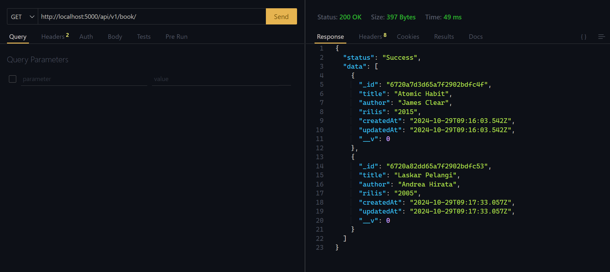

### Mengakses end point Read data buku by id :

```
http://localhost:5000/api/v1/book/672068994dffa18e2c20b5b9
```

Menampilkan data buku by ID buku:
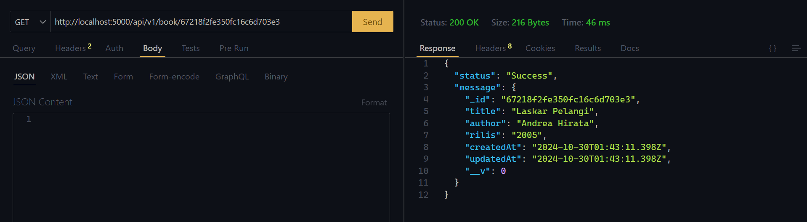

### Mengakses end point update data buku :

```
http://localhost:5000/api/v1/book/6720a82dd65a7f2902bdfc53
```

Menampilkan data update buku:
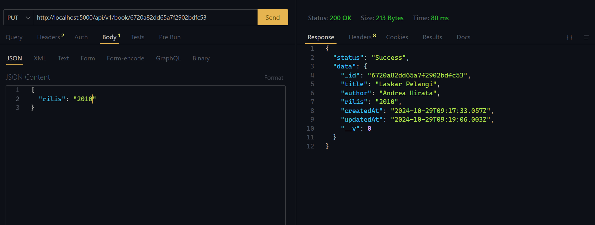

Gagal update buku :
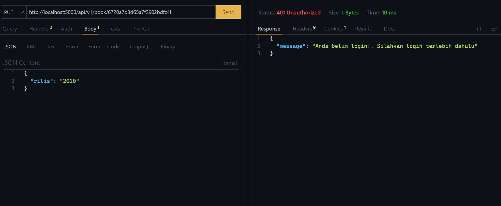

### Mengakses end point delete data buku :

```
http://localhost:5000/api/v1/book/6720a82dd65a7f2902bdfc53
```

Menampilakan data Delete buku:
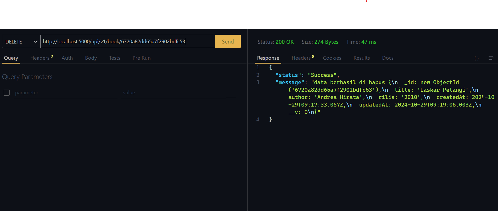

Gagal delete Book:
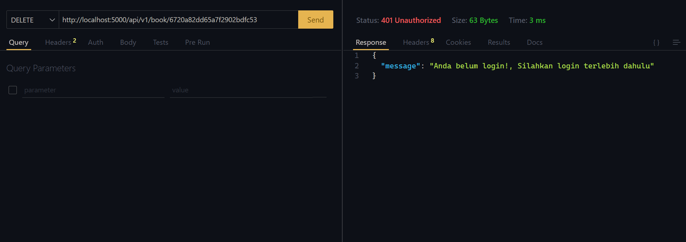

Menampilkan data setelah di delete:
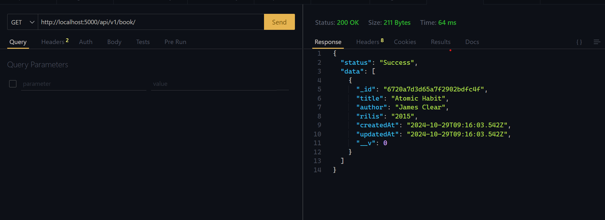

### Data user dan buku di dalam mongo compass

Data user:
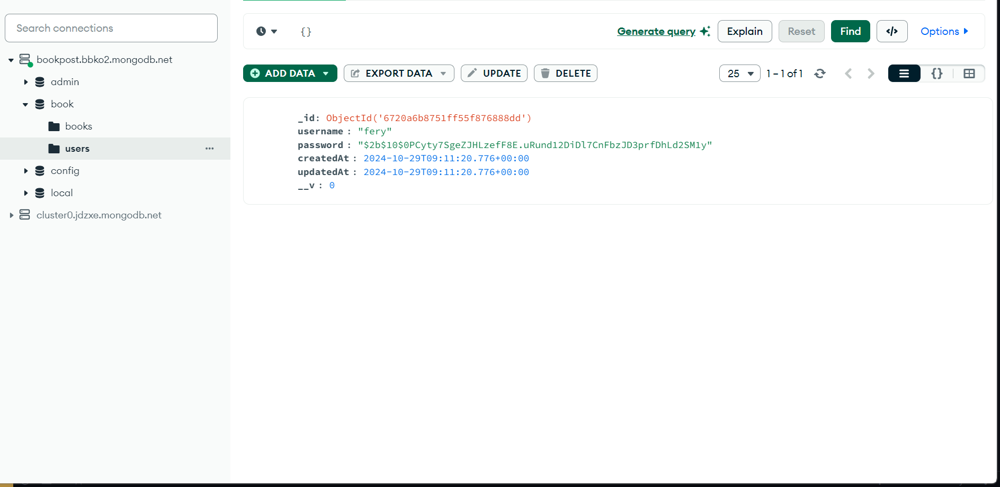

Data buku:
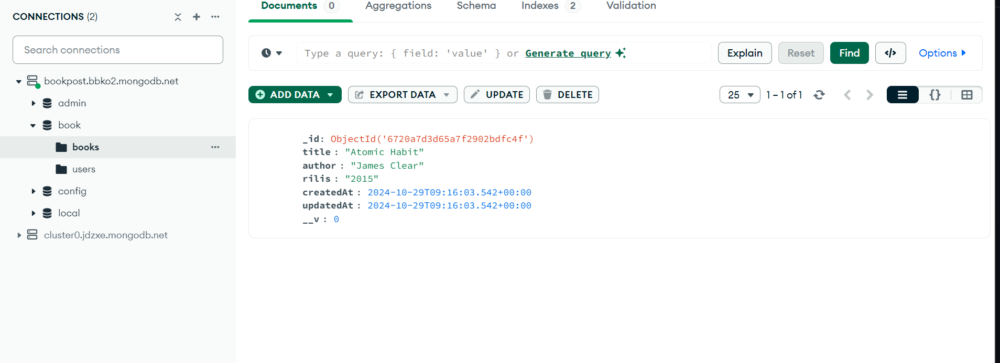

### Swagger UI

```
http://localhost:5000/api-docs/
```

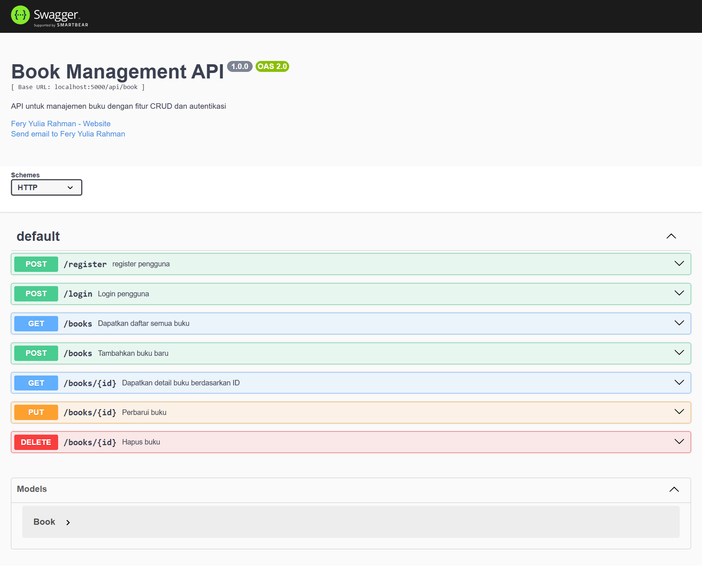
